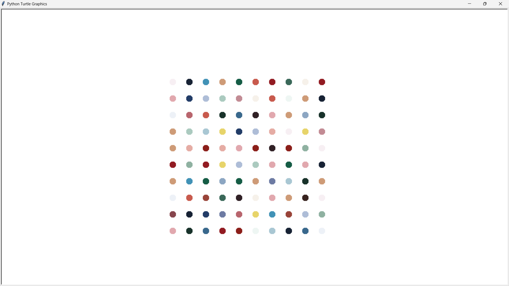

# Spot Drawing Generator

This is a simple Python project that generates a spot painting using the `turtle` module. The program extracts colors from an image using `colorgram`, then randomly places colored dots on the screen in a grid format.

## Features
- Extracts colors from an image (`image.jpeg`)
- Generates a 10x10 grid of randomly colored dots
- Uses the `turtle` module for drawing
- Simple and fun to experiment with

## Installation
1. Clone this repository:
   ```bash
   git clone https://github.com/NomadBeetle/Spot-Drawing-Generator.git
   cd Spot-Drawing-Generator
   ```
2. Install dependencies:
   ```bash
   pip install colorgram.py
   ```

## Usage
1. Place an `image.jpeg` file in the project directory.
2. Run the script:
   ```bash
   python spot_drawing.py
   ```
3. Click on the turtle screen to exit.

## Example Output



---

Feel free to contribute or modify the project as you like!

